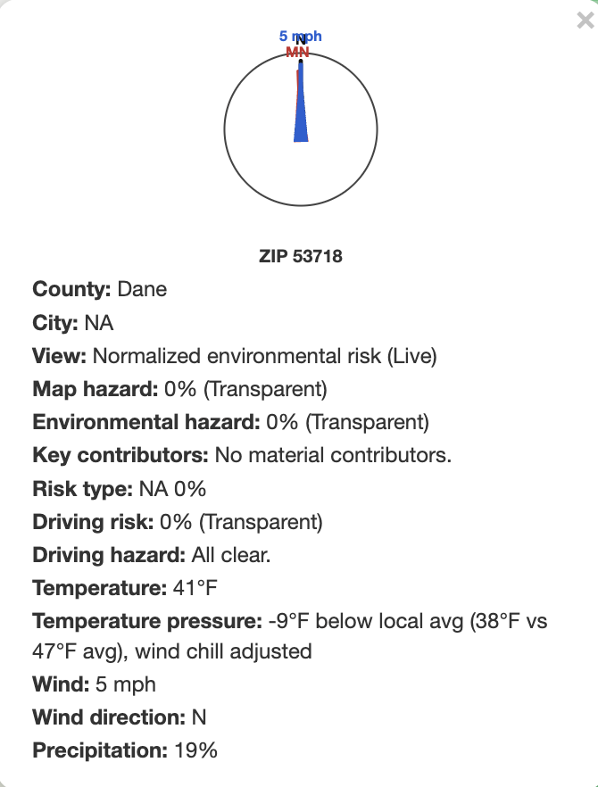
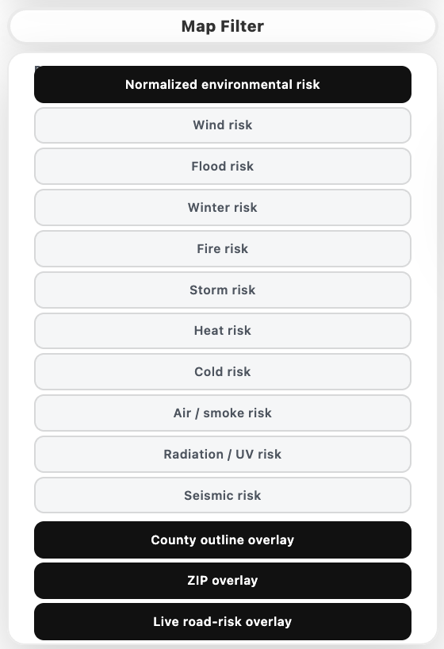
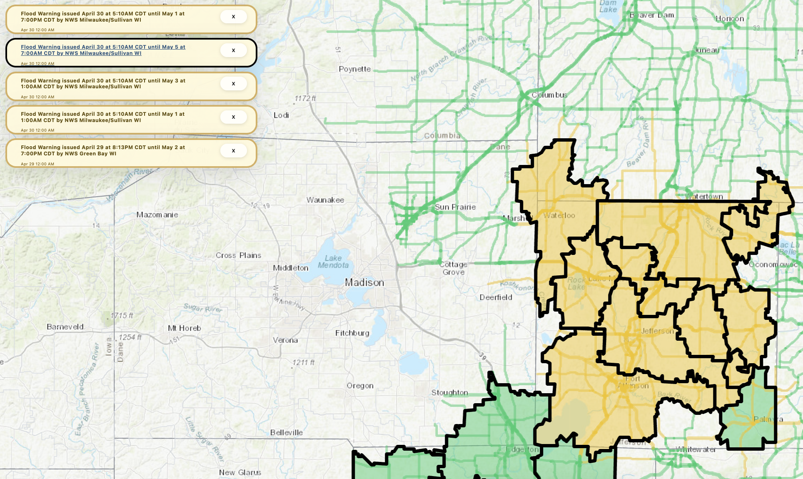
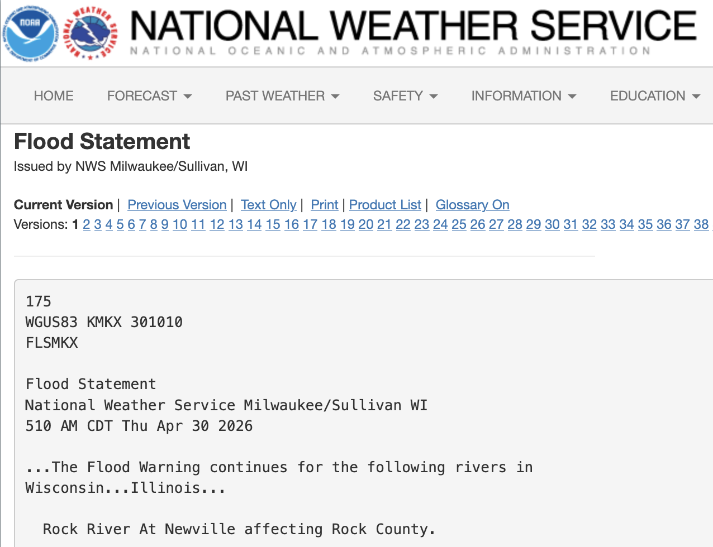
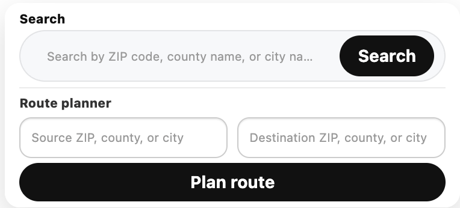
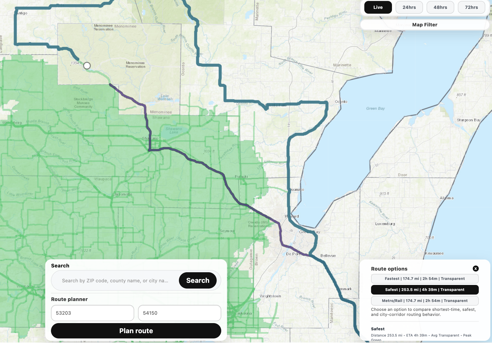
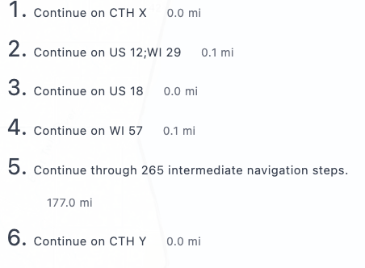

<p align="center">
  
</p>

# FLOWS — Wisconsin's Live Hazard Intelligence Map

**One screen. Every active hazard. The whole state of Wisconsin.**

FLOWS turns the firehose of federal weather, hydrology, air, radiation, seismic, and roadway feeds into a single, beautifully readable Wisconsin map — and then plans you a route that actually respects what's happening on the ground. No paid subscription. No black-box scoring. Just the official feeds, fused together and explained in plain English at the ZIP-code level.

If you've ever wished the National Weather Service, NWPS, AirNow, EPA RadNet, the NRC, USGS, and 511 Wisconsin would all *talk to each other* — that's FLOWS.

---

## Why FLOWS?

- **Built on the sources you already trust.** NWS alerts and forecasts, NWPS river gauges, WPC QPF and winter guidance, SPC fire and convective outlooks, live GOES GLM lightning, HeatRisk, AirNow, EPA UV and RadNet, NRC daily event reports, USGS seismic, NOAA Flood Hazard Outlook, and official 511 Wisconsin road feeds — fused into one coherent picture.
- **Wisconsin-first, ZIP-precise.** Every hazard score is normalized to your ZIP — not a vague "central Wisconsin" blob.
- **Routes that route around trouble.** Pick *Fastest*, *Safest*, or *Metro/Rail*. The road graph is built from OpenStreetMap and re-weighted in real time by live alerts, flooding, lightning, winter conditions, and 511WI closures.
- **Fast paint, full depth.** The map renders in seconds with the essentials, then progressively layers in specialty feeds the moment you ask for them.
- **Transparent by design.** Click any ZIP, segment, or route — every score comes with its contributors and a numeric breakdown. No mystery numbers.

---

## See It In Action

### A Living Hazard Map

Statewide environmental risk, normalized at the ZIP level, with progressive disclosure of specialty layers.



### Filter the Map to *Your* Risk

Switch between normalized environmental risk, wind, flood, winter, fire, storm, heat, air, radiation, seismic, and transport overlays — instantly.



### Real-Time Government Alerts, In Context

Every active National Weather Service alert, scoped to the ZIPs and corridors it actually touches — not just a generic statewide dump.



### Direct Links to the Source

Every alert keeps a click-through to the originating government bulletin. FLOWS shows you the analysis; the official text is one click away.



### Find Anything, Fast

Search by ZIP, county, or city. Wisconsin gazetteer, baked in.



### Risk-Aware Route Planner

Three profiles — *Fastest*, *Safest*, and *Metro/Rail* — over a 97k-edge OpenStreetMap graph re-weighted by live hazards. Optional `cppRouting` backend resolves a typical query in roughly 50 ms.



### Turn-by-Turn Driving Instructions

The route you see is the route you can drive. Step-by-step directions, with hazard-aware segments called out where they matter.



---

## Under the Hood

FLOWS is a Shiny application written in R, designed to render fast and explain itself.

- **Fast paint mode.** First render shows alerts plus forecast temperature, wind, and precipitation — the rest of the families (QPF/flood, winter, convective, fire, heat, cold, air, radiation, seismic, transport) load on demand.
- **ZIP-level scoring.** `data/wi_latitude_band_profiles.csv` drives latitude-normalized temperature scoring so northern and southern Wisconsin are compared fairly.
- **Bundled reference assets.** If `data/reference/wisconsin_reference.gpkg` is present, the app loads Wisconsin counties, ZIPs, places, and roads from disk before reaching for live Census downloads.
- **Source-aware flood scoring.** Flood risk distinguishes rain/QPF-driven flooding from point-gauge flooding, off-gauge hydrologic guidance, nearby river-corridor / National Water Model–style guidance, SPC guidance, and live lightning-driven convective escalation. Popups expose key contributors and a numeric breakdown — not a single opaque reason.
- **Live ionizing-radiation signals.** EPA RadNet Wisconsin monitor anomalies and NRC daily event reports decay across 24h / 48h / 72h horizons rather than being copied forward as literal forecasts.
- **Two-path air quality.** Live views use AirNow hourly observations; 24h / 48h / 72h views use the AirNow reporting-area forecast file with a graceful decayed-live-air fallback.
- **Honest 511WI integration.** When `WI511_API_KEY` is set, official Wisconsin DOT winter-road conditions, travel-time delays, incidents, alerts, and dynamic message signs propagate into ZIP-level transport and driving risk via direct intersection *and* nearby-corridor distance decay.

### Optional Configuration

| Variable | Purpose |
|---|---|
| `NOAA_USER_AGENT` | Overrides the default Weather.gov user agent string. |
| `WI511_API_KEY` | Enables 511WI winter-road, travel-time, event, alert, and message-sign enrichment. |
| `USE_LOCAL_REFERENCE_ONLY` | When `true`, the app fails fast if the bundled reference GeoPackage is missing instead of silently falling back to live Census downloads. |

### Optional R Packages

- **`cppRouting`** — sub-second bidirectional Dijkstra route search. Falls back to an in-process heap-based A* when not installed.
- **`ncdf4`** — required for live GOES GLM lightning ingestion. The convective layer falls back to SPC-only when not installed.

---

## Install & Run

FLOWS is a standard R Shiny application. You'll need **R 4.2+** and (recommended) **RStudio**.

### 1. Clone the repository

```bash
git clone https://github.com/DF4708/FLOWS.git
cd FLOWS
```

Or, using the HTTPS URL directly:

```bash
git clone https://github.com/DF4708/FLOWS/
cd FLOWS
```

### 2. Install R dependencies

From an R session in the project root:

```r
install.packages(c(
  "shiny", "sf", "dplyr", "httr2", "jsonlite", "htmltools",
  "leaflet", "DT"
))

# Optional but recommended:
install.packages(c("cppRouting", "ncdf4"))
```

### 3. (Optional) Configure environment

Copy the template and edit it with any keys you have:

```bash
cp config.example.Renviron .Renviron
```

Then edit `.Renviron` to set, for example:

```
WI511_API_KEY=your-key-here
NOAA_USER_AGENT=YourOrg-FLOWS (contact@example.com)
```

### 4. Launch the app

From the project root in R or RStudio:

```r
shiny::runApp()
```

Or, from the command line:

```bash
Rscript -e "shiny::runApp(launch.browser = TRUE)"
```

The app entry points are `global.R`, `ui.R`, and `server.R`.

---

## Release Preflight

For packaging a local-only release, FLOWS ships with a deterministic build-and-validate pipeline:

```bash
# Build the bundled Wisconsin reference assets (needs internet access):
python scripts/build_wisconsin_reference_assets.py

# Or supply pre-downloaded archives explicitly:
python scripts/build_wisconsin_reference_assets.py \
  --county-archive ... --zcta-archive ... --place-archive ... --roads-archive ...

# Validate the built bundle:
python scripts/validate_wisconsin_reference_assets.py

# Full preflight (validator + R runtime smoke test):
python scripts/release_preflight.py --project-dir . --require-assets --require-r
```

The preflight validates the GeoPackage when present and then runs the R smoke test (`scripts/runtime_smoke_test.R`) when `Rscript` is available, reporting precisely whether any remaining gap is "missing assets," "missing R runtime," or an actual app-load failure.

---

## License & Contact

Copyright © David B. Foster. All rights reserved. Unauthorized copying, distribution, modification, or use of this project, in whole or in part, is strictly prohibited without express written permission of the copyright holder.

Contact: **d.foster@marquette.edu**

Repository: [github.com/DF4708/FLOWS](https://github.com/DF4708/FLOWS/)
