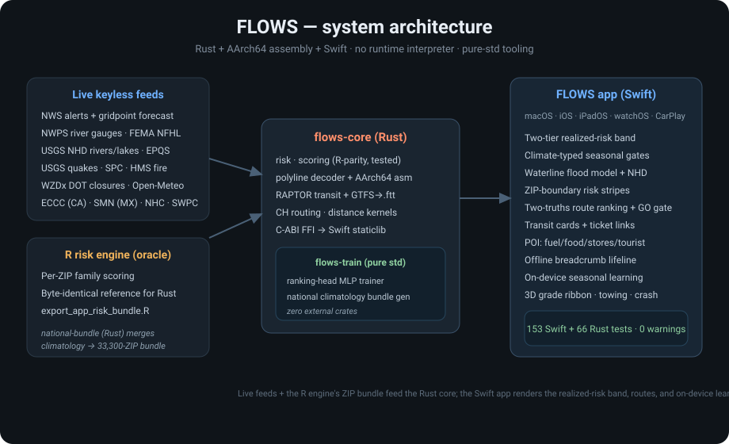
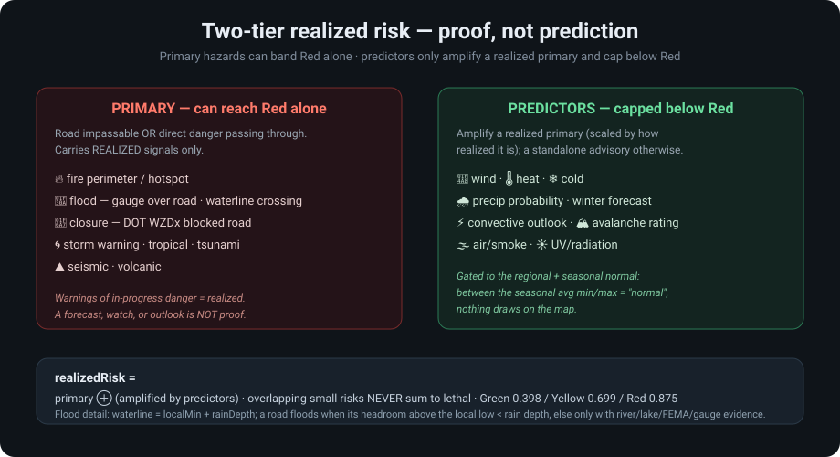

<!--
  Copyright (c) David B. Foster. All rights reserved.
  Contact: wizeman555@gmail.com
  Unauthorized copying, distribution, modification, or use of this file, in
  whole or in part, is strictly prohibited without the express written
  permission of the copyright holder.
-->

<p align="center">
  
</p>

# FLOWS — driving-safety navigation for North America

**One map. Every official hazard. A route that respects what's actually happening on the road.**

FLOWS fuses the firehose of federal and provincial weather, hydrology, fire, air, radiation, seismic, and roadway feeds into a single readable map — then plans a route that understands the difference between *a forecast of rain* and *a road that is actually underwater*. It is a native Apple app (macOS, iOS, iPadOS, watchOS, CarPlay) built on a pure-Rust compute core — one system, end to end — using only official public data. No paid subscription. No black-box scoring.

<p align="center">
  
</p>

---

## What makes FLOWS different

- **Proof, not prediction.** Risk is two-tier. A hazard can only turn a road **Red** if it is *realized* — a fire perimeter you'd drive through, a river gauge over the road, a DOT-reported closure, a tornado/tsunami warning in progress. Forecasts, watches, and outlooks are **predictors**: they amplify a realized hazard but are capped below Red on their own. A pile of small overlapping risks never sums to lethal.

<p align="center">
  
</p>

- **Continental coverage, ZIP-precise.** A 33,300-ZIP on-device risk field — 20 years of NOAA Storm Events history per ZIP × week, reconstructed week-correct on device — backs the whole US uniformly (every state runs on the same system), enriched live by NWS, USGS, FEMA, SPC, HMS, WZDx and more across the US, Canada (ECCC), and Mexico (SMN).

- **Climate-aware, season-aware.** Every location is typed into one of 12 Köppen-style climates computed from geography, so 95 °F reads as dangerous heat in marine Seattle but a normal afternoon in Phoenix. Temperature and wind only surface on the map when they exceed the **regional and seasonal** normal — "normal for here, right now" stays quiet.

- **A flood model that understands terrain.** Flooding is a *waterline threshold*, not "low ground is risky." Rain accumulates at the local minimum and rises by its depth; a road floods when its height above that local low is less than the rain depth. A road above the waterline floods only with **supporting evidence** — a mapped USGS NHD river/lake nearby, a gauge at flood stage, or a FEMA A/V zone. Mountain-town valleys flood in their own terrain; ridgelines don't.

- **Routes that balance two truths.** A route is ranked by both its *realized* corridor risk and the *identified* risk of the ZIPs it crosses, refined over time by an on-device seasonal model that learns your recurring trips. The overall band is **distance-weighted** — a short bad stretch is called out explicitly, not smeared across the whole route.

- **Transparent and offline-tough.** Every score is inspectable. An always-on breadcrumb trail lets you retrace your way out with zero signal — for the woods, the desert, or a dead zone.

---

## Feature tour

| Area | What you get |
|---|---|
| **Risk map** | Transparent ZIP-boundary areas striped by risk level × hazard type; clustered, centroid-snapped hazard badges; live family filters across North America. |
| **Route planning** | Fastest / Safest / Local / Toll-free profiles; **Cheapest** and **Fuel/CO₂-efficient** banners; a **Tourist** filter that pins parks & landmarks and reorders routes by what's worth stopping for; GO unlocks only once a route's weather has actually scored. |
| **Transit** | In-app walk→ride→walk itineraries; rail **and** bus selectable together; exact carrier ticket links (no hand-off to Maps); a Rust RAPTOR engine with a GTFS→`.ftt` ingestion pipeline for real schedules. |
| **Trucker mode** | Height/grade-aware routing, weigh stations, HOS timer, verified truck-stop showers (Pilot/Flying J, Love's, TA/Petro), diesel-by-cost, GPS-nearest NOAA weather radio. |
| **Vehicle & towing** | Fuel/range tracking, live towing-limit warnings vs. published GVWR/tow/GCWR (with labeled class-typical estimates where a maker doesn't publish). |
| **Safety** | Crash detection with assisted 911/contact flow; imminent-alert banners with source links; auto shelter/rest suggestions. |
| **Terrain** | A 3D grade-tinted elevation ribbon drawn from our own EPQS road-elevation data + steep-grade markers. |
| **Learning** | On-device seasonal route model + a ranking head trained by a pure-std Rust trainer; nothing about your trips leaves the device. |

> **Screenshots:** the feature-named images in `images/` show earlier iterations of the map and planner. Refresh them from the current native app on your machine; the banner (`FLOWS_Banner_logo.png`) and app icon are intentionally left unchanged.

---

## The stack

FLOWS ships exactly two languages, by rule: **Rust** (core algorithms, data pipelines, on-device training) and **Swift** (the app). A hand-written AArch64 assembly kernel once carried the polyline hot loop — it was retired when a measured bake-off showed the compiler beating it (the discipline that admitted that is the point: assembly must out-run rustc to ship, and dead fast-variants get deleted). The original Wisconsin R engine has been fully retired — its scoring survives as pinned test fixtures and its 20-year successor pipeline runs in pure Rust. No Python, JavaScript, or interpreter runs in or ships with the product — Python is used only as repo tooling for one-off data checks. Dependencies are taken only when owning the code would be worse; `flows-train` is pure standard library with an empty dependency list.

```
apple/FLOWS/Sources/     Swift app — Core/ (services), UI/, FLOWSApp.swift
rust/flows-core/         risk · scoring · polyline · routing/CH · transit (RAPTOR + GTFS/.ftt) · FFI
rust/flows-train/        pure-std ranking-head trainer + national climatology bundle generator
scripts/                 bundle export, GTFS fetch/build, sync
docs/                    ARCHITECTURE · APPLE_APP · TRANSIT_ROUTING · DATA_FEEDS · TESTING_STRATEGY · LEARNINGS
```

**Tested:** 162 Swift XCTest + 90 Rust tests, zero compiler warnings, `cargo clippy -D warnings` clean in CI. The risk/scoring paths are pinned byte-identical to their original reference oracle's frozen fixtures; the RAPTOR engine is gated against a Dijkstra reference.

---

## Data sources

Nearly everything FLOWS reads is **keyless and free** — NWS/NWPS, Open-Meteo, USGS (quakes, EPQS elevation, NHD hydrography), FEMA NFHL, SPC, NOAA HMS/SWPC/NHC, WZDx DOT closures, Census TIGER, OSM Overpass, ECCC (Canada), SMN (Mexico), EPA fuel economy. Only three sources are optional user-provided keys, and the app degrades gracefully without them:

| Source | Enables | Without it |
|---|---|---|
| Yelp Fusion (free tier) | POI ratings, price tiers, hours | National market-share ordering |
| TomTom (free tier) | Live per-station fuel prices | State-average price estimates |
| Smartcar (connect your own car) | Fuel level, tire-pressure telemetry | Manual vehicle profile |

See `docs/DATA_FEEDS.md` for the full endpoint map.

---

## Status

Active development on `main`. Built for and validated across the US, Canada, and Mexico — every state and province runs on the same unified scoring system. Transit `.ftt` on-device wiring, GTFS fares, and on-device background retraining are the next milestones — see `docs/` for the roadmap.

---

*FLOWS is built on the sources you already trust — NWS, USGS, FEMA, EPA, NOAA, and official DOT feeds — fused, scored transparently, and explained in plain English. Not affiliated with any of these agencies.*
